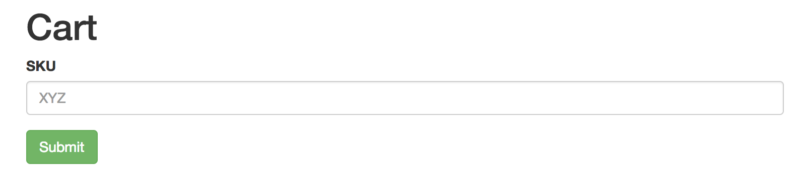

# SRECon Workshop App Bundle

This repository holds an example application that is used to learn the basic concepts of [OpenTracing].

The application itself is a web application with a form to add a product (represented by [SKU]) to the cart.

It is self contained and provides an additional remote API to itself:

- A Cart API on port :8085
- The web application runs on port :8087.

## Running the application

### Golang version

Change current folder to `golang`.

```shell
$ go build -o ot101 ./... && AVAILABILITY_ZONE=<insert AZ value here> INSTANCE_ID=<insert a value here to identify your instance> ./ot101
```

### Java Version

Change current folder to `java`.

```shell
$ mvn spring-boot:run
```

### Docker

In each folder you can find `make` tasks to help you build and run application:

```shell
$ make docker.run
```

And then point your browser at http://localhost:8087



You have to enter a string as the [SKU] to add to the cart and press submit. If there's enough
stock you'll get a success message or a failure message otherwise. The stock availability is
randomized and can be 0.

[SKU]: https://en.wikipedia.org/wiki/Stock_keeping_unit
[OpenTracing]: https://opentracing.io/
